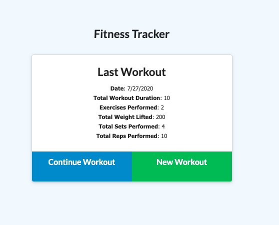
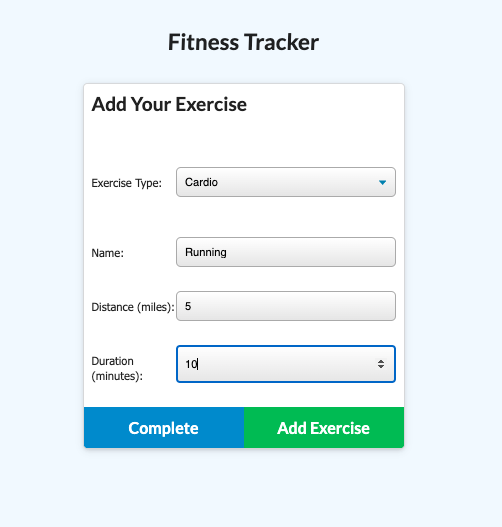
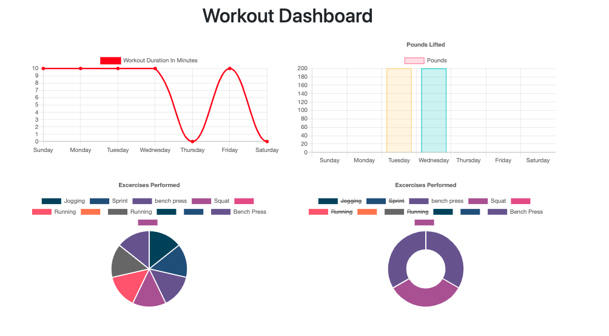

# Unit 17 Nosql Homework: Workout Tracker

For this assignment, you'll create a workout tracker. You have already been provided with the front end code in the `Develop` folder. This assignment will require you to create Mongo database with a Mongoose schema and handle routes with Express.

## Acceptance Criteria

[Link to Deployed Site](https://shielded-harbor-40100.herokuapp.com/)
[Link to GitHub Repo](https://github.com/jenniferdaeumler/gt-nosql-workouttracker-hw-17)

## Description

This application allows users to utilizes Mongo database with a Mongoose schema and handle routes with Express. Users can view current workouts, add new workouts, and complete workouts. Users can view stats of their workout routines with multiple graphs. They can also view the combined weight of multiple exercises on the `stats` page.

## Table of Contents

1. [Installation](#installation)
2. [Usage](#usage)
3. [Credits](#credits)
4. [MIT License](#mit-license)
5. [Contributing](#contributing)

## Installation

Click on the deployed site link to view on Heroku.
OR
Clone the repo, and run the server, and view in local.

## Usage

Open app via Heroku link. Click on new workout to create a new one. Click complete when complete. To continue the workout, click continue workout. Click on Dashboard to view your stats.
OR, if running locally -->
After installing the proper npm packages. Run "node server.js" in the terminal. Go to the local host in browser.

## Credits

Solo projected completed as homework for Georgia Tech Full-Stack Flex Program.
Trilogy Education provided assets.

## MIT-License

Copyright (c) [2020][jennifer daeumler]

Permission is hereby granted, free of charge, to any person obtaining a copy
of this software and associated documentation files (the "Software"), to deal
in the Software without restriction, including without limitation the rights
to use, copy, modify, merge, publish, distribute, sublicense, and/or sell
copies of the Software, and to permit persons to whom the Software is
furnished to do so, subject to the following conditions:

The above copyright notice and this permission notice shall be included in all
copies or substantial portions of the Software.

THE SOFTWARE IS PROVIDED "AS IS", WITHOUT WARRANTY OF ANY KIND, EXPRESS OR
IMPLIED, INCLUDING BUT NOT LIMITED TO THE WARRANTIES OF MERCHANTABILITY,
FITNESS FOR A PARTICULAR PURPOSE AND NONINFRINGEMENT. IN NO EVENT SHALL THE
AUTHORS OR COPYRIGHT HOLDERS BE LIABLE FOR ANY CLAIM, DAMAGES OR OTHER
LIABILITY, WHETHER IN AN ACTION OF CONTRACT, TORT OR OTHERWISE, ARISING FROM,
OUT OF OR IN CONNECTION WITH THE SOFTWARE OR THE USE OR OTHER DEALINGS IN THE
SOFTWARE.

## Contributing

If you created an application or package and would like other developers to contribute it, you will want to add guidelines for how to do so. The [Contributor Covenant](https://www.contributor-covenant.org/) is an industry standard, but you can always write your own.
